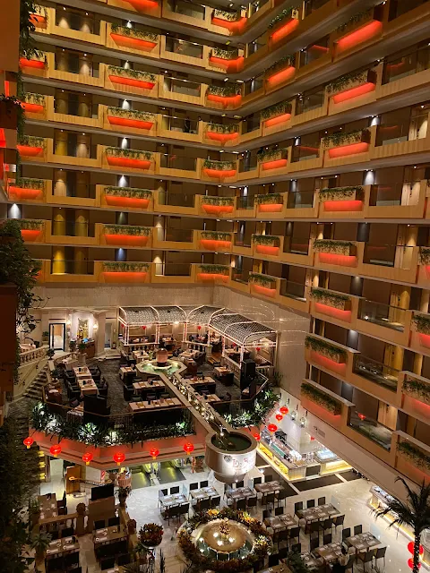
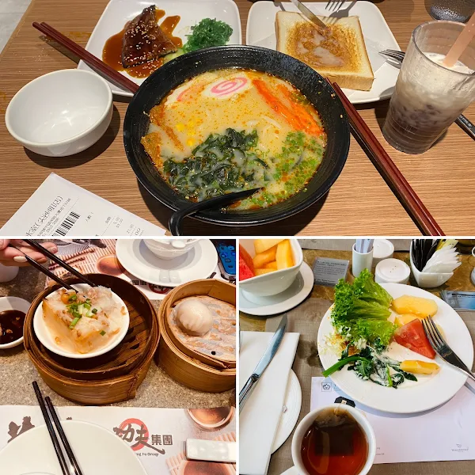
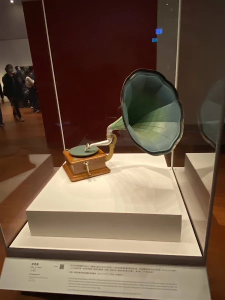
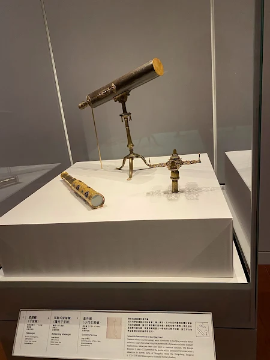
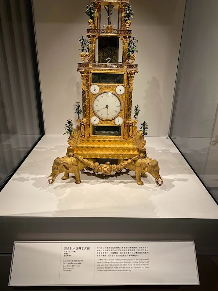
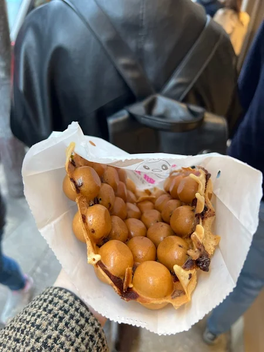
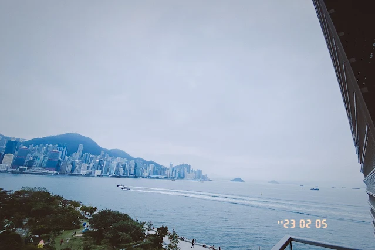
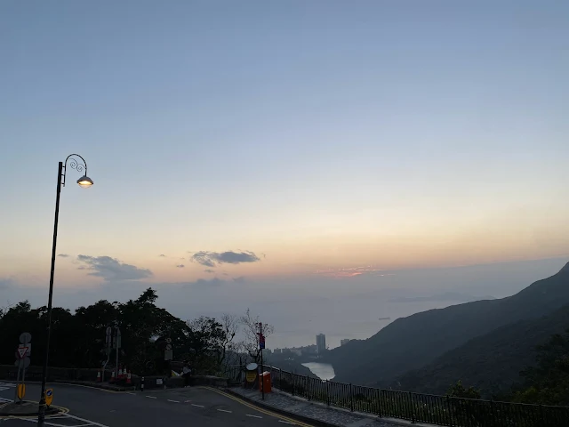
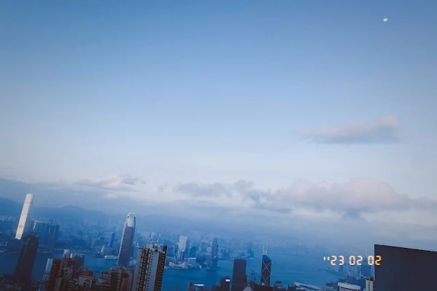
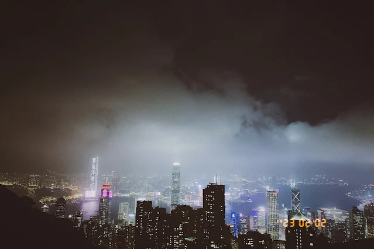

和許多九十年代出生的人一樣，香港黃金時代的經典電影與流行歌曲一路伴隨我成長，走過夢幻的童年。 那時的香港正處於一個如夢似幻歲月流金的年代，是一座讓人對未來的充滿希望，令人著迷的城市。 於是想著有朝一日，定要去拜訪看看。

工作後，去過很多地方，不知何時起漸漸覺得，和我所在的城市上海比，香港應該也只是另一座摩登都市，反而沒有很想去探索的慾望。 每次出門旅行，總是傾向去異國遊玩。

去年因為上海lockdown，讓我們錯過了整個春天。 被奪走的美好的東西，總想著找回來，那時候就再想，解封後一定要出趟遠門，去呼吸那新鮮自由的空氣！ 等過完春節回上海，一切都還未從lockdown中緩過神來，考慮到當時情況，香港便成了可選的首站城市。

2023年農曆正月初十，初春，咋暖還寒，帶著一路興奮與期待，我們坐上了上海飛往香港的飛機！

<!-- 
下榻的飯店讓人想起了布達佩斯大飯店 -->

  
   
  下榻的飯店讓人想起了布達佩斯大飯店

  
   
  元宵節在飯店旁隨機的選到的一家好吃的茶餐廳

參觀香港故宮博物院，看到了許多明清時期的展品，藉此一窺那個時代人們的生活。

  
   
  博物院的展品

   
  

   
   
  街邊的好吃的雞蛋仔

   
   
  在博物院的露臺上俯瞰維港

趕在黃昏日落前，爬上太平山頂，追到了最後一抹夕陽的柔光，這時山間吹來陣陣涼風，拂去白日的些許悶熱，一切令人舒適鬆弛。

   
   
  太平山頂的日落

   
   
  圓月升起，海風吹拂著五千年的維港

   
   
  夜幕降临，俯瞰华灯初上的城市

未完待續...